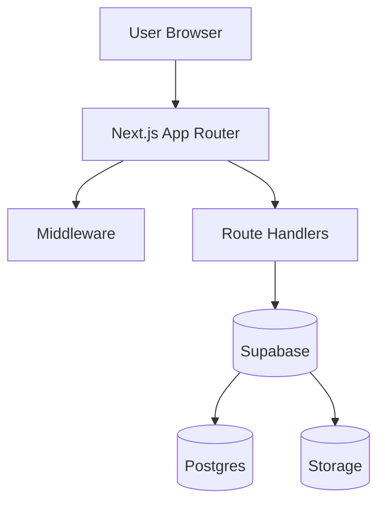

# Full-Stack Portfolio 2

A production-style **full‑stack portfolio application** built to demonstrate senior‑level engineering practices using **Next.js App Router** and **Supabase**.

This project focuses on **end‑to‑end ownership**: authentication, authorization, data validation, secure server APIs, and maintainable architecture.

---

## Tech Stack

- **Framework:** Next.js (App Router), TypeScript
- **Backend:** Supabase (Auth, Postgres, Storage)
- **Validation:** Zod
- **Styling:** Tailwind CSS
- **Testing:** Vitest
- **Deployment-ready:** SSR auth, RLS-secured database, server-only mutations

---

## Features

- Public portfolio pages (projects listing)
- Admin dashboard with full CRUD for projects
- OAuth authentication via Supabase
- Role-based access control (admin-only actions)
- Image uploads using Supabase Storage
- Server-side input validation
- Row Level Security (RLS) enforced at the database layer

---

## Architecture Overview



### Key Ideas

- **Server-first design**: data fetching and mutations happen on the server
- **Middleware for UX**, RLS for real security
- **Strict API boundaries** using validation + whitelisting
- **Clear separation** between UI, API, and data access

See detailed breakdown:

- `docs/ARCHITECTURE.md`

---

## Authentication & Security

- OAuth authentication via Supabase
- Server-side session handling (SSR-compatible)
- Admin authorization via `profiles.is_admin`
- All sensitive operations executed server-side
- Postgres Row Level Security (RLS) enforces permissions at the database layer

Detailed explanation:

- `docs/SECURITY_AUTH_RLS.md`

---

## API Validation

- All write endpoints use **Zod schemas**
- Inputs are validated and whitelisted before DB writes
- Consistent error response format
- Prevents schema drift and unsafe writes

Schemas:

- `src/lib/validation/projects.ts`

API docs:

- `docs/API.md`

---

## Project Structure (simplified)

```
src/
  app/
    api/
    admin/
  lib/
    validation/
    http/
docs/
supabase/
tests/
```

---

## Running Locally

1. Install dependencies

```bash
npm install
```

2. Create `.env.local`

```env
NEXT_PUBLIC_SUPABASE_URL=
NEXT_PUBLIC_SUPABASE_ANON_KEY=
SUPABASE_SERVICE_ROLE_KEY=
```

3. Run the app

```bash
npm run dev
```

---

## Testing

```bash
npm test
```

Tests focus on:

- Input validation correctness
- API boundary behavior
- Error handling stability

See:

- `docs/TESTING.md`

---

## Design Decisions & Tradeoffs

Key decisions explained:

- Why Next.js App Router
- Why Supabase + RLS
- Why server-side auth
- Validation strategy

See:

- `docs/DECISIONS.md`

---

## What I Would Do at Scale

This project is intentionally scoped, but designed to grow.

Planned scale improvements:

- Caching & revalidation for public pages
- Rate limiting & audit logs for admin APIs
- Private storage + signed URLs
- Observability (logging, metrics, error reporting)
- CI/CD with migrations and preview environments

Details:

- `docs/SCALE.md`

---

## Summary

This repository demonstrates:

- Real-world full-stack patterns
- Secure server-side architecture
- Production-minded validation & authorization
- Clear documentation and maintainability focus

It is designed to reflect how I build and reason about systems as a **Senior Full‑Stack Engineer**.
