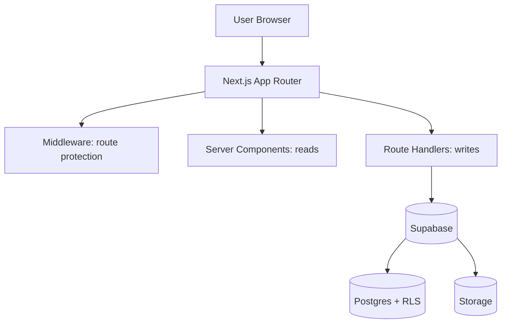

# Architecture

This app is intentionally small, but structured like a production system: clear boundaries, secure server-side mutations,
and a database policy layer (RLS) that remains correct even if the UI or middleware is bypassed.

## Goals
- **Fast public pages** (read-heavy)
- **Secure admin actions** (write-heavy)
- **SSR-friendly auth** (no client secrets)
- **Maintainable structure** (easy to extend)

## High-level diagram



## Components

### Next.js (App Router)
- **Server Components** are used for read flows (public portfolio pages).
- **Route Handlers** implement server-side mutation endpoints (admin CRUD, uploads).
- **Middleware** prevents navigation to protected routes without auth/admin, improving UX and reducing accidental access.

### Supabase
- **Auth**: OAuth and session management.
- **Postgres**: application data (e.g., `projects`) + `profiles` for admin role.
- **Storage**: image hosting via a bucket (public or private, depending on your needs).

## Boundaries & responsibilities

- **UI**
  - Responsible for presentation and calling server endpoints.
  - Must never receive privileged credentials (service role keys).

- **Server routes (Route Handlers)**
  - The authoritative boundary for:
    - authentication/authorization checks
    - input validation + field whitelisting
    - consistent error responses

- **Database (Postgres + RLS)**
  - The ultimate security boundary:
    - ensures rules are enforced even if requests bypass middleware
    - prevents privilege escalation and unintended writes

## Suggested directory layout

```
src/
  app/
    (public pages)
    admin/            # UI for admin
    api/
      admin/          # admin-only endpoints
  lib/
    validation/       # Zod schemas (input boundary)
    http/             # parseJson, HttpError, response helpers
    supabase/         # server/client helpers
docs/
  ARCHITECTURE.md
  SECURITY_AUTH_RLS.md
  API.md
  DECISIONS.md
  TESTING.md
  SCALE.md
supabase/
  migrations/
tests/
```

## Data model (conceptual)
- `profiles`:
  - `id` (uuid, equals `auth.users.id`)
  - `is_admin` boolean

- `projects`:
  - `title`, `description`
  - `tags` (text array)
  - `live_url`, `repo_url`
  - `image_url` (external) and/or `image_path` (storage object path)

## Key invariants
- All writes are validated (Zod) and authorized (admin).
- RLS policies mirror server-side authorization.
- Storage policies match the intended visibility (public vs private).
